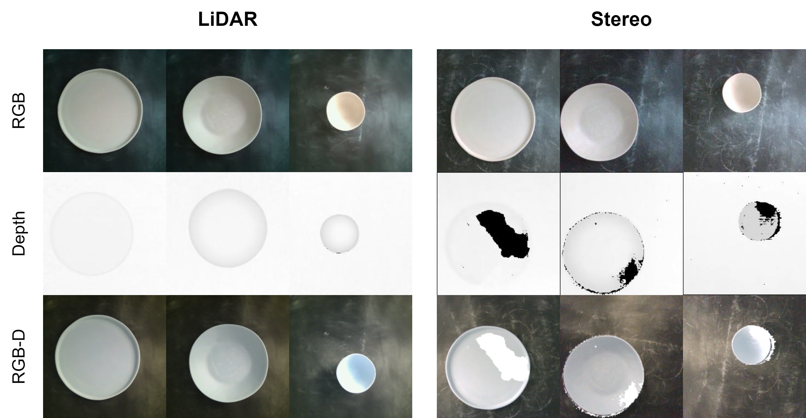

# CeramicNet
The CeramicNet consists of 2,496 real-world images divided into 8 classes, each with a size of 224x224 pixels. Two variations of this dataset are available, distinguished by the caption, LiDAR, and stereo characteristics.

